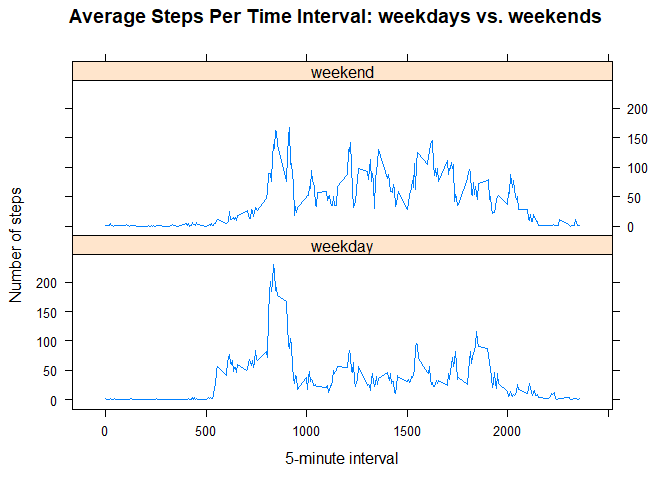

# Loading and processing the data

***Fix timezone***

```r
Sys.setlocale("LC_TIME","English")
```

```
## [1] "English_United States.1252"
```

***Process the source dataset file***

```r
filename <- "./activity.csv"

if(!file.exists(filename)){
  fileUrl <- "https://d396qusza40orc.cloudfront.net/repdata%2Fdata%2Factivity.zip"
  zipFile <- "./repdata_data_activity.zip"
  download.file(fileUrl,destfile = zipFile, method = "curl")
  unzip(zipFile)
}
```

***Read the csv file***

```r
activityData <- read.csv(filename, colClasses = c("integer", "Date", "factor"))
```


***Get information about the variables***

```r
str(activityData)
```

```
## 'data.frame':	17568 obs. of  3 variables:
##  $ steps   : int  NA NA NA NA NA NA NA NA NA NA ...
##  $ date    : Date, format: "2012-10-01" "2012-10-01" ...
##  $ interval: Factor w/ 288 levels "0","10","100",..: 1 226 2 73 136 195 198 209 212 223 ...
```

As we can see, the variables included in this dataset are:

1. steps: Number of steps taking in a 5-minute interval (missing values are coded as NA)
2. date: The date on which the measurement was taken in YYYY-MM-DD format
3. interval: Identifier for the 5-minute interval in which measurement was taken

***Clean dataset of NA values***

```r
activityNoNA <- na.omit(activityData)
rownames(activityNoNA) <- 1:nrow(activityNoNA)
head(activityNoNA)
```

```
##   steps       date interval
## 1     0 2012-10-02        0
## 2     0 2012-10-02        5
## 3     0 2012-10-02       10
## 4     0 2012-10-02       15
## 5     0 2012-10-02       20
## 6     0 2012-10-02       25
```

***Load required libraries***

```r
library(ggplot2)
library(lattice)
```

# What is mean total number of steps taken per day?

For this part of the assignment, we will ignore the missing values in the dataset.

***1. Make a histogram of the total number of steps taken each day***


```r
stepsPerDay <- aggregate(activityNoNA$steps, list(activityNoNA$date), FUN=sum)
colnames(stepsPerDay) <- c("Date", "Steps")

ggplot(stepsPerDay, aes(Steps)) +
  geom_histogram(fill = "steelblue", binwidth = 2500, col="black") +
  labs(title = "Total Number of Steps Taken Each Day", x = "Steps", y = "Frequency") +
  theme(plot.title = element_text(face="bold", size=15, hjust = 0.5),
        panel.grid.major = element_blank(), panel.grid.minor = element_blank(),
        panel.background = element_blank(), axis.line = element_line(colour = "black"))
```

<!-- -->

***2. Calculate and report the mean and median total number of steps taken per day***


```r
mean(stepsPerDay$Steps)
```

```
## [1] 10766.19
```

```r
median(stepsPerDay$Steps)
```

```
## [1] 10765
```

# What is the average daily activity pattern?

***Make a time series plot (i.e. type = “l”) of the 5-minute interval (x-axis) and the average number of steps taken, averaged across all days (y-axis)***


```r
averageSteps <- aggregate(activityNoNA$steps, 
                          list(interval = as.numeric(as.character(activityNoNA$interval))), 
                          FUN= mean)

names(averageSteps)[2] <- "meanSteps"

ggplot(averageSteps, aes(interval, meanSteps)) +
  geom_line(col="steelblue", size=1) + 
  labs(title = "Average Steps Per 5-Minute Interval", x = "5-minute Intervals", y = "Average Steps per day") +
  theme(plot.title = element_text(face="bold", size=15, hjust = 0.5),
        panel.grid.major = element_blank(), panel.grid.minor = element_blank(),
        panel.background = element_blank(), axis.line = element_line(colour = "black"))
```

<!-- -->


***Which 5-minute interval, on average across all the days in the dataset, contains the maximum number of steps?***


```r
averageSteps[averageSteps$meanSteps == max(averageSteps$meanSteps), ]
```

```
##     interval meanSteps
## 104      835  206.1698
```

# Imputing missing values

***The total number of rows with NA***


```r
checkForNA <- sum(is.na(activityData))
resultNA <- ifelse(checkForNA == 0, print("Dataset contains no NA values."),
                     print(paste("Dataset contains", checkForNA, "NA values.")))
```

```
## [1] "Dataset contains 2304 NA values."
```

***Devise a strategy for filling in all of the missing values in the dataset.***

We will use the mean of 5-minute interval to fill each NA value in the steps column.


```r
#Create a new dataset from the original dataset but with the missing data filled in.
newActivity <- activityData 
for (i in 1:nrow(newActivity)) {
  if (is.na(newActivity$steps[i])) {
    newActivity$steps[i] <- averageSteps[which(newActivity$interval[i] == averageSteps$interval), ]$meanSteps
  }
}

head(newActivity)
```

```
##       steps       date interval
## 1 1.7169811 2012-10-01        0
## 2 0.3396226 2012-10-01        5
## 3 0.1320755 2012-10-01       10
## 4 0.1509434 2012-10-01       15
## 5 0.0754717 2012-10-01       20
## 6 2.0943396 2012-10-01       25
```

```r
# Confirm new data is without NA values
checkForNA <- sum(is.na(newActivity))
resultNA <- ifelse(checkForNA == 0, print("New dataset contains no NA values."),
       print(paste("New dataset contains", checkForNA, "NA values.")))
```

```
## [1] "New dataset contains no NA values."
```

***Make a histogram of the total number of steps taken each day and Calculate and report the mean and median total number of steps taken per day.***


```r
stepsPerDayTotal <- aggregate(newActivity$steps, list(newActivity$date), FUN=sum)
colnames(stepsPerDayTotal) <- c("Date", "Steps")

ggplot(stepsPerDayTotal, aes(Steps)) +
  geom_histogram(fill = "steelblue", binwidth = 2500, col="black") +
  labs(title = "Total Number of Steps Taken Each Day (no missing data)", x = "Steps", y = "Frequency") +
  theme(plot.title = element_text(face="bold", size=15, hjust = 0.5),
        panel.grid.major = element_blank(), panel.grid.minor = element_blank(),
        panel.background = element_blank(), axis.line = element_line(colour = "black"))
```

<!-- -->

***Do these values differ from the estimates from the first part of the assignment? What is the impact of imputing missing data on the estimates of the total daily number of steps?***


```r
# Mean total number of steps taken per day
newMean <- mean(stepsPerDayTotal$Steps); print(newMean)
```

```
## [1] 10766.19
```

```r
# Median total number of steps taken per day
newMedian <- median(stepsPerDayTotal$Steps); print(newMedian)
```

```
## [1] 10766.19
```

```r
# Calculations to check mean & median values for old and new dataset

oldMean <- mean(stepsPerDay$Steps); print(oldMean)
```

```
## [1] 10766.19
```

```r
oldMedian <- median(stepsPerDay$Steps); print(oldMedian)
```

```
## [1] 10765
```

```r
checkMean <- newMean - oldMean
checkMedian <- newMedian - oldMedian

resultMean <- ifelse(checkMean==0, print("Old Mean and New Mean are the same"),
                       print(paste("Old Mean and New Mean are not the same. The difference is", checkMean)))
```

```
## [1] "Old Mean and New Mean are the same"
```

```r
resultMedian <- ifelse(checkMedian==0, print("Old Median and New Median are the same"),
                         print(paste("Old Median and New Median are not the same. The difference is", checkMedian)))
```

```
## [1] "Old Median and New Median are not the same. The difference is 1.1886792452824"
```

Comparing plots we can also see an increase in frequency. So, adding missing values can cause different results.

# Are there differences in activity patterns between weekdays and weekends?

***Create a new factor variable in the dataset with two levels – “weekday” and “weekend” indicating whether a given date is a weekday or weekend day.***


```r
newActivity$weekday <- weekdays(newActivity$date)
newActivity$dayType <- ifelse(newActivity$weekday=="Saturday" | newActivity$weekday=="Sunday", "weekend","weekday")

# check if new columns created properly
table(newActivity$weekday, newActivity$dayType)
```

```
##            
##             weekday weekend
##   Friday       2592       0
##   Monday       2592       0
##   Saturday        0    2304
##   Sunday          0    2304
##   Thursday     2592       0
##   Tuesday      2592       0
##   Wednesday    2592       0
```

***Make a panel plot containing a time series plot (i.e. type = “l”) of the 5-minute interval (x-axis) and the average number of steps taken, averaged across all weekday days or weekend days (y-axis).***


```r
averageSteps <- aggregate(newActivity$steps, 
                      list(interval = as.numeric(as.character(newActivity$interval)), 
                      weekdays = newActivity$dayType),
                      FUN=mean)

names(averageSteps)[3] <- "meanSteps"

xyplot(averageSteps$meanSteps ~ averageSteps$interval | averageSteps$weekdays, 
       layout = c(1, 2), 
       type = "l",
       font = 2,
       main = "Average Steps Per Time Interval: weekdays vs. weekends",
       xlab = "5-minute interval", ylab = "Number of steps")
```

<!-- -->


