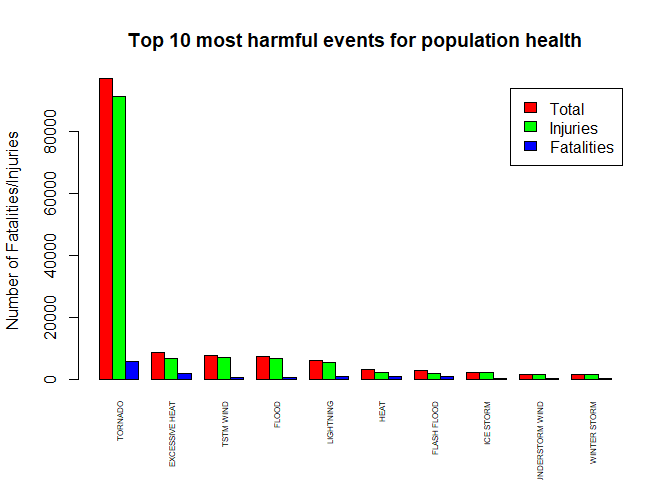
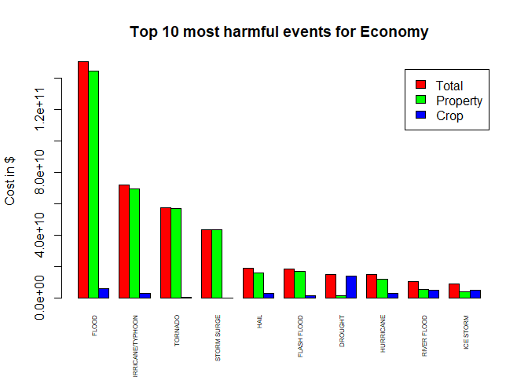

## 1. Synopsis

In this report, we will analyze the impact of different weather events on public health and economy in the US. Our source data are from the U.S. National Oceanic and Atmospheric Administration's (NOAA) storm database and cover the period 1950-2011.
In this analysis, we will investigate and decide which types of weather events that had the most effect on health and economy.

## 2. Data Processing

In this section, we will load and tranform the data for our needs. We will also create functions that will help us produce some results from our research.

### 2.1 Get the data


```r
filename <- "./repdata_data_StormData.csv"
if(!file.exists(filename)){
  fileUrl <- "https://d396qusza40orc.cloudfront.net/repdata%2Fdata%2FStormData.csv.bz2"
  zipFile <- "./repdata_data_StormData.csv.bz2"
  download.file(fileUrl,destfile = zipFile, method = "curl")
  unzip(zipFile)
}
```


```r
# Load required library
require(dplyr)
```

### 2.2 Load the csv file


```r
data <- read.csv(filename)

# Examine the columns
colnames(data)
```

```
##  [1] "STATE__"    "BGN_DATE"   "BGN_TIME"   "TIME_ZONE"  "COUNTY"    
##  [6] "COUNTYNAME" "STATE"      "EVTYPE"     "BGN_RANGE"  "BGN_AZI"   
## [11] "BGN_LOCATI" "END_DATE"   "END_TIME"   "COUNTY_END" "COUNTYENDN"
## [16] "END_RANGE"  "END_AZI"    "END_LOCATI" "LENGTH"     "WIDTH"     
## [21] "F"          "MAG"        "FATALITIES" "INJURIES"   "PROPDMG"   
## [26] "PROPDMGEXP" "CROPDMG"    "CROPDMGEXP" "WFO"        "STATEOFFIC"
## [31] "ZONENAMES"  "LATITUDE"   "LONGITUDE"  "LATITUDE_E" "LONGITUDE_"
## [36] "REMARKS"    "REFNUM"
```

### 2.3 Transform the data


```r
# Keep only columns needed for the analysis
data <- select(data, EVTYPE, FATALITIES, INJURIES, PROPDMG, PROPDMGEXP, CROPDMG, CROPDMGEXP)

# check new data
str(data)
```

```
## 'data.frame':	902297 obs. of  7 variables:
##  $ EVTYPE    : Factor w/ 985 levels "   HIGH SURF ADVISORY",..: 834 834 834 834 834 834 834 834 834 834 ...
##  $ FATALITIES: num  0 0 0 0 0 0 0 0 1 0 ...
##  $ INJURIES  : num  15 0 2 2 2 6 1 0 14 0 ...
##  $ PROPDMG   : num  25 2.5 25 2.5 2.5 2.5 2.5 2.5 25 25 ...
##  $ PROPDMGEXP: Factor w/ 19 levels "","-","?","+",..: 17 17 17 17 17 17 17 17 17 17 ...
##  $ CROPDMG   : num  0 0 0 0 0 0 0 0 0 0 ...
##  $ CROPDMGEXP: Factor w/ 9 levels "","?","0","2",..: 1 1 1 1 1 1 1 1 1 1 ...
```

```r
# Create a dataset to store the total of fatalities and injuries per weather event
totalHealthEffects <- data %>% select(EVTYPE, FATALITIES, INJURIES) %>% 
                           group_by(EVTYPE) %>%
                           summarise_at(vars(FATALITIES, INJURIES), sum) %>%
                           mutate(TOTAL = FATALITIES + INJURIES) %>%
                           arrange(desc(TOTAL))

# Include only the top 10 most harmful events for population health
totalHealthEffects <- totalHealthEffects[1:10, ]

# Create a function to fix values of PROPDMGEXP and CROPDMGEXP
fixValues <- function(x, y) { 
    if (x > 0) {
      data[, x] <- as.character(data[, toupper(x)])
      data[data[, x] == "B", x] <- "9"
      data[data[, x] == "M", x] <- "6"
      data[data[, x] == "K", x] <- "3"
      data[data[, x] == "H", x] <- "2"
      data[data[, x] == "", x] <- "0"
      data[, x] <- 10^(as.numeric(data[, x]))
      data[is.na(data[, x]), x] <- 0
    }
    if (y > 0) {
      data[, y] <- as.character(data[, toupper(y)])
      data[data[, y] == "B", y] <- "9"
      data[data[, y] == "M", y] <- "6"
      data[data[, y] == "K", y] <- "3"
      data[data[, y] == "H", y] <- "2"
      data[data[, y] == "", y] <- "0"
      data[, y] <- 10^(as.numeric(data[, y]))
      data[is.na(data[, y]), y] <- 0
    }
    return(data)
}

# Fix values of PROPDMGEXP and CROPDMGEXP
data <- fixValues("PROPDMGEXP", "CROPDMGEXP")

# Create a dataset to store the total of economy effects per weather event
totalEconomyEffects <- data %>% select(EVTYPE, PROPDMGEXP, PROPDMG, CROPDMG, CROPDMGEXP) %>%
                   mutate(PROPDMG = PROPDMG * PROPDMGEXP, CROPDMG= CROPDMG * CROPDMGEXP) %>% 
                   group_by(EVTYPE) %>% 
                   summarise_at(vars(PROPDMG, CROPDMG), sum) %>% 
                   mutate(TOTAL = PROPDMG + CROPDMG) %>% 
                   arrange(desc(TOTAL))

# Reorder columns for better graph presentation
totalEconomyEffects = totalEconomyEffects[, c("EVTYPE", "CROPDMG", "PROPDMG", "TOTAL")]

# Include only the top 10
totalEconomyEffects <- totalEconomyEffects[1:10, ]
```

## 3. Results

In this section, we will present the results of our research. We will clearly see the effects of severe weather events on population health and economy.

### 3.1 Impact on Population Health

***Top 10 most harmful events for population health***

```r
totalHealthEffects
```

```
## # A tibble: 10 x 4
##    EVTYPE            FATALITIES INJURIES TOTAL
##    <fct>                  <dbl>    <dbl> <dbl>
##  1 TORNADO                 5633    91346 96979
##  2 EXCESSIVE HEAT          1903     6525  8428
##  3 TSTM WIND                504     6957  7461
##  4 FLOOD                    470     6789  7259
##  5 LIGHTNING                816     5230  6046
##  6 HEAT                     937     2100  3037
##  7 FLASH FLOOD              978     1777  2755
##  8 ICE STORM                 89     1975  2064
##  9 THUNDERSTORM WIND        133     1488  1621
## 10 WINTER STORM             206     1321  1527
```

***Graphic presentation***

```r
barplot(t(as.matrix(totalHealthEffects[,4:2])),
              names.arg = totalHealthEffects$EVTYPE,
              las=3,
              cex.names = 0.5,
              beside = TRUE,
              ylab = "Number of Fatalities/Injuries",
              main = "Top 10 most harmful events for population health",
              legend = c("Total", "Injuries", "Fatalities"),
              col = c("Red", "Green", "Blue"))
```

<!-- -->

Our conclusion on this is that Tornado has the most harmful impact on population health.

### 3.2 Impact on Economy

***Top 10 most harmful events for population health***

```r
totalEconomyEffects
```

```
## # A tibble: 10 x 4
##    EVTYPE                CROPDMG       PROPDMG         TOTAL
##    <fct>                   <dbl>         <dbl>         <dbl>
##  1 FLOOD              5661968450 144657709807  150319678257 
##  2 HURRICANE/TYPHOON  2607872800  69305840000   71913712800 
##  3 TORNADO             414953270  56935880616.  57350833886.
##  4 STORM SURGE              5000  43323536000   43323541000 
##  5 HAIL               3025537473  15730367513.  18755904986.
##  6 FLASH FLOOD        1421317100  16822673978.  18243991078.
##  7 DROUGHT           13972566000   1046106000   15018672000 
##  8 HURRICANE          2741910000  11868319010   14610229010 
##  9 RIVER FLOOD        5029459000   5118945500   10148404500 
## 10 ICE STORM          5022113500   3944927860    8967041360
```

***Graphic presentation***

```r
barplot(t(as.matrix(totalEconomyEffects[,4:2])),
               names.arg = totalEconomyEffects$EVTYPE,
               las=3,
               cex.names = 0.5,
               beside = TRUE,
               ylab = "Cost in $",
               main = "Top 10 most harmful events for Economy",
               legend = c("Total", "Property", "Crop"),
               col = c("Red", "Green", "Blue"))
```

<!-- -->

Our conclusion on this is that Flood has the most harmful impact on economy.

